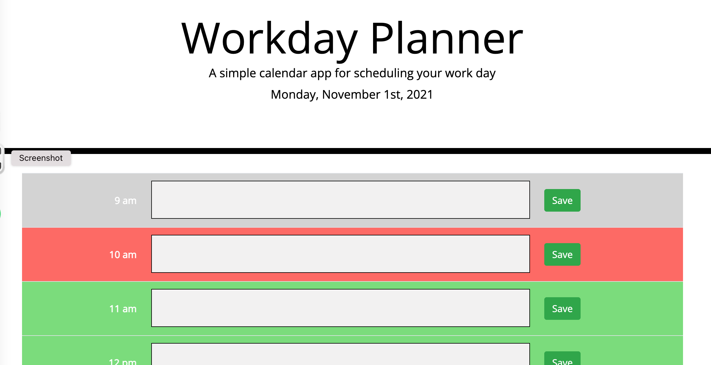

# Workday Planner

[](https://opensource.org/licenses/MIT)


## Table of Contents
- [Description](#description)
- [Credits](#credits)
- [License](#license)

## Description
This project uses local storage to create a daily planner. The page utilises javascript to create the table of hours. The tasks are stored in an array of objects which is then saved to local storage.

This project is deployed using GitHub pages at https://josephdaw.github.io/work-day-planner/. 



### User Story

```md
AS AN employee with a busy schedule
I WANT to add important events to a daily planner
SO THAT I can manage my time effectively
```

### Mock-Up
The following animation demonstrates the application functionality:


## Credits
- This user story is part of the [Adelaide University Coding Boot Camp](https://bootcamps.adelaide.edu.au).
- I used this [Stack Overflow Thread](https://stackoverflow.com/questions/49850253/update-value-of-one-object-in-array) to assist me in updating my objects stored in the local storage array.

## License
This project is released under the [MIT License](LICENSE)